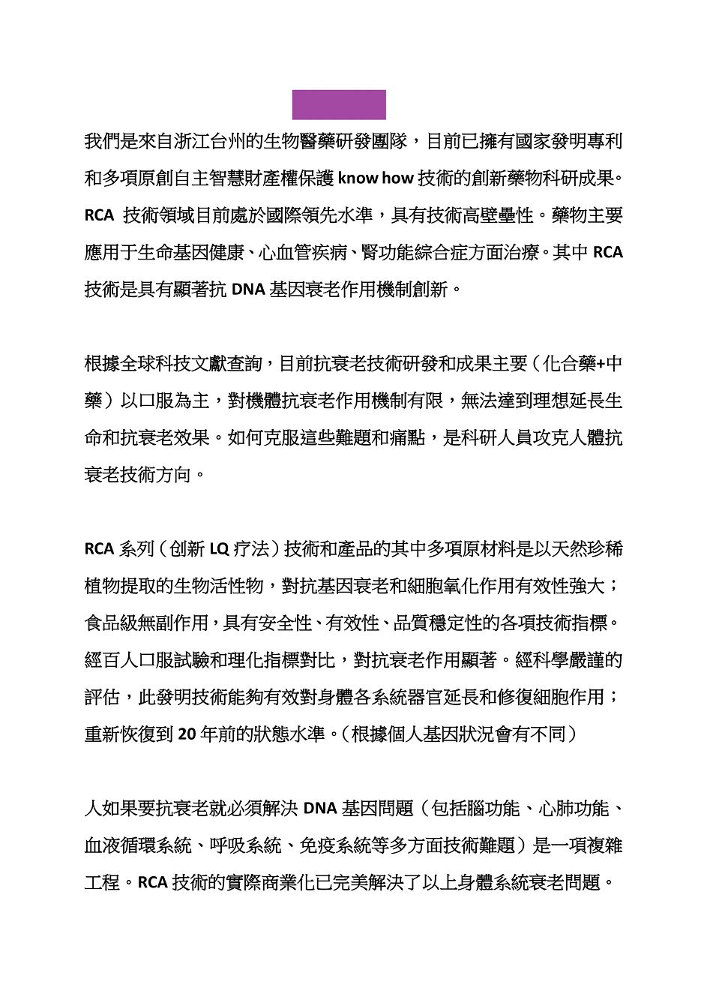
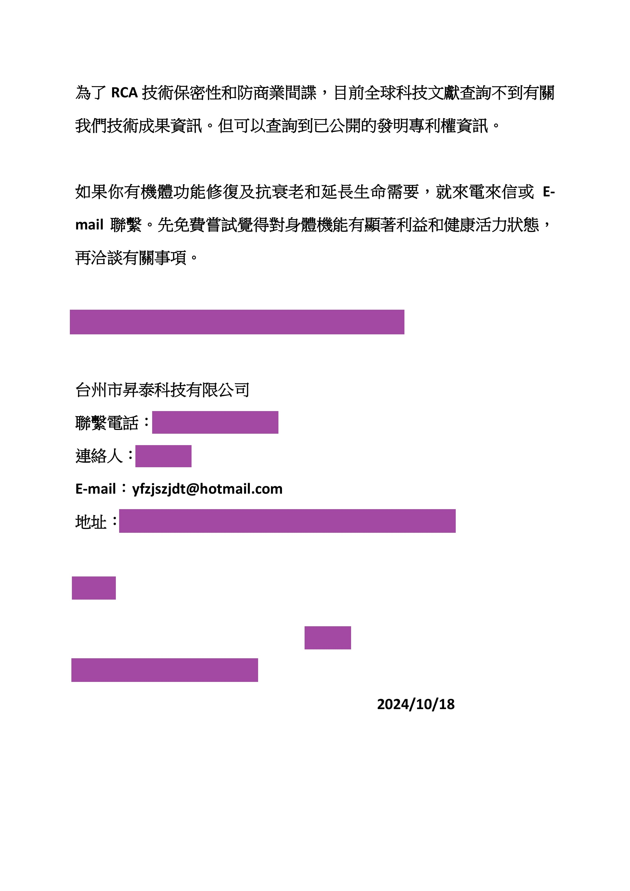
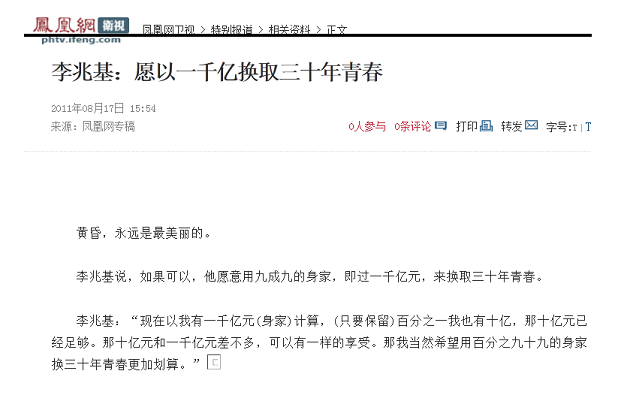

# 最新独家发现的抗衰老活性物

## 抗衰老不是一种药或一台设备就可以实现的，需要颠覆性的技术和突破性的系统治疗方案。

MTD多中心联合医疗方案不完美；贝索斯投资30亿美元开发的基因编辑技术离临床应用还遥遥无期，目前抗衰老有关的商品主要有NMN、NAD+、麦角硫因、姜黄素、二甲双胍等，这些产品都有副作用，抗衰老效果并不理想。但是在广告宣传中经常能见到。他们铺天盖地的营销，只是一种噱头罢了。

但是最好的技术，并不一定最会营销。现在有了一种颠覆性的技术和突破性的系统治疗方案。

我们是来自浙江台州的生物医药研发团队，目前已拥有国家发明专利和多项原创自主知识产权保护know how技术的创新药物科研成果。RCA技术领域目前处于国际领先水平，具有技术高壁垒性。药物主要应用于生命基因健康、心血管疾病、肾功能综合症方面治疗。其中RCA技术是具有显著抗DNA基因衰老作用机制创新。

根据全球科技文献查询，目前抗衰老技术研发和成果主要（化合药+中药）以口服为主，对机体抗衰老作用机制有限，无法达到理想延长生命和抗衰老效果。如何克服这些难题和痛点，是科研人员攻克人体抗衰老技术方向。

RCA系列技术和产品的其中多项原材料是以天然珍稀植物提取的生物活性物，对抗基因衰老和细胞氧化作用有效性强大；食品级无副作用，具有安全性、有效性、质量稳定性的各项技术指标。经百人口服试验和理化指标对比，对抗衰老作用显著。经科学严谨的评估，此发明技术能够有效对身体各系统器官延长和修复细胞作用；重新恢复到20年前的状态水平。（根据个人基因状况会有不同）

人如果要抗衰老就必须解决DNA基因问题（包括脑功能、心肺功能、血液循环系统、呼吸系统、免疫系统等多方面技术难题）是一项复杂工程。RCA技术的实际商业化已完美解决了以上身体系统衰老问题。

为了RCA技术保密性和防商业间谍，目前全球科技文献查询不到有关我们技术成果信息。但可以查询到已公开的发明专利权信息。

如果你有机体功能修复及抗衰老和延长生命需要，就来电来信或E-mail联系。先免费尝试觉得对身体机能有显著利益和健康活力状态，再洽谈有关事项。

台州市昇泰科技有限公司

E-mail：yfzjszjdt@hotmail.com

                                      2024/10/18

2011年，有人在媒体上说出“愿以一千亿换取三十年青春”

通过我们的技术延长寿命一段时间，没有问题。我们决定给他一个机会，看他是不是真的想要最新的技术。

一封信件在2024年10月18日寄出，最终送至香港白加道35号，这不是一封普通的信件，这封信件代表着延长寿命的机会。

但是信件没有收到回复，说出“愿以一千亿换取三十年青春”的人没有抓住延长寿命的机会。

后来的事大家都知道了：

2024年11月29日

有人在香港白加道35号拍到了李兆基的照片，当时的李兆基看起来‬已经身体‬出现了‬异样‬，不能‬行走‬，需要轮椅代步。

2025年3月17日

没有抓住机会的人死了，不再活着代表不再有资格享受财富。

“愿以一千亿换取三十年青春”的人抓不住机会享受前沿科技，给你机会你不中用啊。

拥有2400亿资产的人到底在自己身上花了多少钱？

最后自媒体传出了一条2023年的截图：某香港李姓富豪秘密购置了一台高压氧舱用于抗衰老治疗

一台高压氧舱售价几十万，不是先进技术。

事实很离谱：身家有2400亿，根本不舍得为自己花钱，只花几十万，买的还不是最先进技术。

世界是一个巨大的草台班子，原来有钱人的眼光只不过如此。
